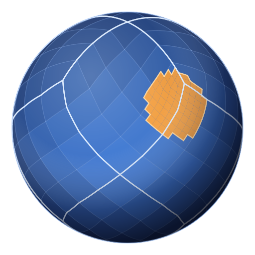

<p align="center">
  
</p>

<h1 align="center">REALPix</h1>

<p align="center">
  <em>HEALPix for Rust — reference-exact, allocation-free, <code>no_std</code>.</em>
</p>

<p align="center">
  <a href="https://github.com/Joatin/realpix/actions/workflows/ci.yaml"></a>
  <a href="https://crates.io/crates/realpix"></a>
  <a href="https://docs.rs/realpix"></a>
</p>

**`REALPix`** is a pure-Rust implementation of **HEALPix** — the Hierarchical Equal Area
isoLatitude Pixelisation of the sphere — in both the **NESTED** and **RING** numbering
schemes.

Cell indices are **bit-identical to the reference C++ implementation** (and therefore to
`healpy`), which is enforced by golden test vectors committed to the repository. The crate
is built for the inner loop of astrometry and plate solving: allocation-free hot paths, no
`unsafe`, and `no_std`-capable.

```toml
[dependencies]
realpix = "0.2"
```

> **Upgrading from 0.1.x? Read [CHANGELOG.md](CHANGELOG.md) first.** 0.1's projection did
> not implement HEALPix: measured against this release, which is pinned to `healpy`, the
> two agree on 2.6% of sky positions. Stored 0.1.x indices have to be recomputed from the
> original coordinates — there is no mapping from the old numbering to the correct one. The
> changelog has the full migration table.

---

## Contents

* [Features](#features) · [Quick start](#quick-start) · [What is HEALPix?](#what-is-healpix)
* [RING vs NESTED](#ring-vs-nested) · [Cone search](#cone-search) · [Coverage maps](#coverage-maps)
* [Expanding a search outwards](#expanding-a-search-outwards) · [Hashing in bulk](#hashing-in-bulk)
* [Coordinate conventions](#coordinate-conventions) · [Performance](#performance) · [Cargo features](#cargo-features)
* [Correctness](#correctness) · [Status](#status) · [Changelog](CHANGELOG.md) · [License](#license)

---

## Features

* ✅ Reference-exact NESTED and RING indexing, verified against `healpy`
* 🌌 `(lon, lat)`, colatitude/longitude, and unit-vector entry points
* 🧭 Cell centres, corners, the eight neighbours of a cell, and the ring of cells
  surrounding it at any deeper resolution
* 🔭 Cone search in **both schemes**, returning sorted index ranges ready to slice a
  sorted catalogue
* 🌲 Hierarchy: parents, children, and descendant ranges at any depth
* 🗺️ Multi-order coverage maps (MOCs) with exact union, intersection and difference
* ⚡ ~10 ns per position-to-cell conversion, singly or in bulk, allocation-free throughout
* 🦀 100% safe Rust (`#![forbid(unsafe_code)]`)
* 🚫 Real `no_std` support via `libm`

---

## Quick start

```rust
use realpix::nested;

// `get` is a `const fn`: binding the layer to a `const` folds every derived constant
// into the call site.
const LAYER: nested::Layer = nested::get(12);

let cell = LAYER.hash(1.549_729, 0.129_277);   // (lon, lat) in radians
let (lon, lat) = LAYER.center(cell);
let corners = LAYER.vertices(cell);            // [N, W, S, E] as unit vectors
let neighbours = LAYER.neighbours(cell);       // [Option<u64>; 8]

// Cross to the RING scheme and back.
let r = LAYER.to_ring(cell);
assert_eq!(cell, realpix::ring::get(12).to_nested(r));

// Which ranges of a catalogue sorted by NESTED index cover this field of view?
LAYER.cone_coverage(realpix::lonlat_to_vec(1.55, 0.13), 5f64.to_radians(), |range| {
    // slice the catalogue by `range`
    let _ = range;
});
```

---

## What is HEALPix?

HEALPix divides the sphere into 12 base cells, each subdivided into an `nside × nside`
grid, for `12 × nside²` cells of **exactly equal area**. `nside` is always a power of two,
so a layer is identified by its **depth** (also called order), with `nside = 2^depth`.

| depth | nside | cells | cell size |
| ----: | ----: | ----: | --------: |
| 0 | 1 | 12 | 58.6° |
| 5 | 32 | 12 288 | 1.8° |
| 10 | 1 024 | 12.6 M | 3.4′ |
| 16 | 65 536 | 51.5 G | 3.2″ |
| 29 | 536 870 912 | 3.5 × 10¹⁸ | 0.4 mas |

Depth 29 is the deepest layer whose NESTED indices fit in a `u64`, and is the maximum this
crate supports.

---

## RING vs NESTED

Both schemes describe the same cells; they differ only in how those cells are numbered.

**NESTED** numbers cells hierarchically, so the `4^k` descendants of a cell form one
contiguous range at every deeper depth. Spatially close cells have close indices, which is
what makes range queries and multi-resolution indexing work. **Use this for catalogues,
quad matching and cone searches.**

**RING** numbers cells ring by ring from the north pole, so indices are ordered by
decreasing latitude. This is the layout spherical-harmonic transforms expect.

---

## Cone search

`cone_coverage` is available on both schemes, and in both cases the result is:

* **sorted, disjoint and non-adjacent** — ready to binary-search a catalogue with,
* **inclusive** — a superset of the exact cover. A few cells that come close to the
  boundary without touching it can be included, but a cell that intersects the cone is
  never missed.
* **allocation-free** — results are handed to a closure. `cone_coverage_ranges` and
  `cone_coverage_cells` collect into a `Vec` when the `alloc` feature is on.

The two get there by different routes. **NESTED** walks the quad-tree from the 12 base
cells, emitting a whole subtree as a single range as soon as it is provably inside the
cone and refining only the cells that straddle its boundary. **RING** walks the
iso-latitude rings the disc reaches and computes the arc each one subtends, at a fixed
amount of trigonometry per ring and no descent at all.

They return about the same thing. Measured at `(1.55, 0.13)`:

| | NESTED | RING |
| --- | ---: | ---: |
| depth 8, r=0.5° | 8 ranges, 26 cells | 10 ranges, 34 cells |
| depth 8, r=3° | 45 ranges, 607 cells | 43 ranges, 632 cells |
| depth 12, r=3° | 724 ranges, 139 353 cells | 641 ranges, 139 353 cells |

Range counts are comparable — RING runs slightly ahead on large discs, slightly behind on
small ones. Cell counts are within a few percent, and identical once the disc spans many
cells: RING does no boundary refinement, so it over-includes more on the smallest discs
(~33% against NESTED's ~20%), but that band stops mattering as the disc grows.

Where they differ sharply is cost. The RING search is **~26–34x faster** — 14 µs against
366 µs for a depth-16 disc — because it visits one unit per ring the disc reaches, where
the descent visits the boundary of the disc at every level on the way down.

So: **pick the scheme your catalogue is already sorted in.** Neither search is the
compromise; they cover the same disc about equally well.

Both prune with the same geometric bound, `max_center_to_vertex(depth)` — the radius of the
smallest disc centred on a cell that still contains the whole cell. It is public, because
it is also what you need to widen a margin by so a search cannot miss a source lying
anywhere in a cell it touches.

---

## Hashing in bulk

`hash_many` and `hash_many_vec` fill a buffer you already own, on both schemes:

```rust
let layer = realpix::nested::get(12);
let sources = [(1.549_729, 0.129_277), (1.372_198, -0.143_146)];
let mut cells = [0u64; 2];
layer.hash_many(&sources, &mut cells);
assert_eq!(cells[0], layer.hash(sources[0].0, sources[0].1));
```

This is for the call site, not for speed: measured against the equivalent loop it is the
same to within noise, because a hash costs what its transcendental costs and batching does
not remove that. At depth 12, `hash` is ~10 ns per position of which ~3 ns is the `sin`,
and `hash_vec` is ~33 ns of which ~15 ns is the `atan2`. There is no SIMD here — stable
Rust has no portable SIMD, and `core::arch` intrinsics need `unsafe`, which this crate
forbids. A vectorised `sin` would also not be bit-identical to `healpy`, which is the
guarantee the whole test suite exists to hold.

---

## Expanding a search outwards

A match near the edge of a cell has neighbours in the next cell over. `external_edge` gives
the ring of cells immediately surrounding a cell, at whatever resolution you ask for:

```rust
let layer = realpix::nested::get(10);
let cell = layer.hash(1.549_729, 0.129_277);

// The eight neighbours, and the finer ring two levels down.
let adjacent = layer.external_edge_cells(cell, 10);
let finer = layer.external_edge_cells(cell, 12);
assert_eq!(adjacent.len(), 8);
assert_eq!(finer.len(), 4 * 4 + 4);
```

`edge_depth` is absolute, matching `children_range`. With `n` cells along the side of the
cell the ring holds `4n + 4` — four sides and four corners — less one corner wherever the
cell sits on a point where only three base cells meet, since no cell exists there. That
costs 24 cells of any layer one corner each, and every base cell two.

`external_edge_cells` returns them sorted, ready to binary-search a catalogue.
`external_edge` hands them to a closure instead, walking once around the ring and
allocating nothing.

---

## Coverage maps

A cone is one shape. `moc::Moc` is any shape: a set of cells drawn from whatever mix of
depths describes the region most compactly — the sky a survey reached, the union of the
fields solved so far, the part of a catalogue worth searching.

```rust
use realpix::moc::Moc;

let first  = Moc::from_cone(10, realpix::lonlat_to_vec(1.00, 0.5), 0.02);
let second = Moc::from_cone(10, realpix::lonlat_to_vec(1.01, 0.5), 0.02);

let observed = &first | &second;        // union
let overlap  = &first & &second;        // intersection
let missed   = &second - &first;        // difference
let elsewhere = !&observed;             // complement

println!("{:.5} sr observed", observed.area());
assert!(observed.contains_lonlat(1.0, 0.5));

// Still slices a catalogue sorted by NESTED index, at whatever depth you keep it at.
for range in observed.ranges_at(12) {
    let _ = range;
}
```

Internally a coverage is one sorted list of disjoint ranges of depth-29 cells, so the set
operations are linear merges over two sorted lists and are **exact at every depth** — no
rounding to a common depth, and no approximation. Equality is meaningful too: two
coverages of the same region compare equal whatever depths each was built from.

The multi-order view is there when you want it. `cells()` decomposes a coverage into the
largest cells that tile it exactly — big shallow cells in the interior, progressively
smaller ones towards the boundary — and `uniq_cells()` gives those as NUNIQ values, the
form MOCs are normally serialised in. `ranges_at(depth)` goes the other way, flattening a
coverage to index ranges at one depth, rounding outward so the result stays a superset.

Requires the `alloc` feature (on by default). See `examples/moc_coverage.rs`.

---

## Coordinate conventions

Angles are radians throughout.

| | |
| --- | --- |
| `lon`, right ascension | `[0, 2π)`, wrapped on input |
| `lat`, declination | `[-π/2, π/2]` |
| `theta` (colatitude) | `[0, π]`, `0` at the north pole |
| unit vector | `[x, y, z]`, `z = sin(lat)` |

`hash(lon, lat)` and `hash_theta_phi(theta, phi)` differ by one ulp in how `z` is derived,
which only matters for a position landing exactly on a cell boundary. `hash_vec` accepts a
vector of any length and is the most accurate entry point near the poles.

---

## Performance

Measured on an Apple M-series laptop at depth 12 — the minimum over many runs, with the
result of every call passed through `black_box` so nothing is elided. Cell indexing costs
the same at any depth; only the cone searches scale with it.

| operation | time |
| --- | ---: |
| `hash(lon, lat)` → cell | 9.6 ns |
| `hash_vec(v)` → cell | 37.9 ns |
| `ring::hash(lon, lat)` → cell | 11.5 ns |
| `center(cell)` → `(lon, lat)` | 16.6 ns |
| `center_vec(cell)` → vector | 22.6 ns |
| `vertices(cell)` → 4 corners | 49.3 ns |
| `neighbours(cell)` → all 8 | 11.4 ns |
| `neighbour(cell, N)` → one | 3.8 ns |
| `to_ring(cell)` / `to_nested(cell)` | 5.8 ns / 8.9 ns |
| `external_edge`, 3 levels down (36 cells) | 116 ns |
| `cone_coverage`, depth 8, r = 0.05 rad (563 cells) | 16.5 µs |
| `cone_coverage`, depth 12, r = 0.05 rad (127 k cells) | 247 µs |
| `ring::cone_coverage`, depth 12, r = 0.05 rad | 8.8 µs |
| `Moc` union / intersection / difference (156 ranges each) | 540 / 525 / 404 ns |

`hash` costs roughly what its `sin` costs, and `hash_vec` what its `atan2` costs — the
projection either side of the transcendental is shifts, masks and a handful of
multiplications, because `nside` is a power of two. `hash(lon, lat)` performs no division
at all; `hash_vec` pays one, to normalise the vector the way the reference does. Nothing on
any hot path allocates except the `Vec`-returning conveniences and
[`Moc`](#coverage-maps), which say so in their names or their feature gate.

---

## Cargo features

| feature | default | effect |
| --- | :---: | --- |
| `std` | ✅ | floating point from `std`; implies `alloc` |
| `alloc` | ✅ | `Vec`-returning convenience methods |
| `libm` | | floating point from `libm`, for `no_std` builds |
| `latlong` | | `RaDec` entry points via the [`latlong`](https://crates.io/crates/latlong) crate (implies `std`) |

For a bare-metal target:

```toml
realpix = { version = "0.2", default-features = false, features = ["libm"] }
```

---

## Correctness

The test suite pins the implementation to the official HEALPix numbering rather than to
itself:

* **Golden vectors** generated from `healpy` (`tools/gen_golden.py`) and committed under
  `tests/data/`: ~4 700 position-to-cell samples across depths 0–29 including poles, the
  belt/cap transition, and base-cell boundaries; cell centres; scheme conversions;
  neighbours; cell corners; and reference discs. Indices must match exactly.
* **Exhaustive round-trips** to depth 6 and sampled at every depth to 29, for both
  schemes and both the angle and vector entry points.
* **Structural invariants**: the schemes are a bijection, RING indices are ordered by
  latitude, ring lengths are `4r`/`4·nside`/`4r`, neighbours are symmetric, exactly 24
  cells have seven neighbours, and cell corners are shared with their neighbours.
* **Equal area**, by Monte Carlo: uniformly random directions must populate every cell
  within Poisson noise.
* **Cone inclusiveness**: for random discs, every point inside the disc lands in a covered
  cell, and the coverage contains `healpy`'s exact disc.
* The geometric bound the cone search prunes with is re-derived and re-checked by the test
  suite at every depth.

Every public function carries a runnable example, so the documentation is executed by the
test suite rather than merely written — `cargo test --all-features` runs every one of them
alongside the rest, and a claim in a doc comment cannot quietly stop being true.

Every public function is also benchmarked, under an id of the form `module::function`:

```
cargo bench --all-features
```

`tests/bench_coverage.rs` checks that set against the source in both directions, so a new
public function cannot land without a benchmark, and a benchmark cannot outlive the
function it names.

Regenerate the golden files with:

```
uv run --python 3.12 --with healpy --with numpy python tools/gen_golden.py         # rewrite
uv run --python 3.12 --with healpy --with numpy python tools/gen_golden.py --check # verify
```

---

## Status

* ✔ NESTED and RING indexing, reference-exact
* ✔ Cell centres, corners, neighbours, external edge, hierarchy, `uniq` (NUNIQ) encoding
* ✔ Cone search as index ranges, in both NESTED and RING
* ✔ Multi-order coverage maps with exact set algebra
* ✔ Bulk hashing, gnomonic (tangent plane) projection, `RaDec` entry points
* 🚧 Polygon and elliptical-cone queries
* 🚧 Bilinear interpolation weights

0.2.0 is released. It replaced the pre-0.2 API wholesale, so upgrading from 0.1.x is a
port rather than a bump — [CHANGELOG.md](CHANGELOG.md) has the migration table, and every
entry in it is compiled by `tests/migration.rs` so the advice cannot rot.

---

## License

<sup>
Licensed under either of <a href="LICENSE-APACHE">Apache License, Version
2.0</a> or <a href="LICENSE-MIT">MIT license</a> at your option.
</sup>

<br>

<sub>
Unless you explicitly state otherwise, any contribution intentionally submitted
for inclusion in this crate by you, as defined in the Apache-2.0 license, shall
be dual licensed as above, without any additional terms or conditions.
</sub>

---

## Inspiration

* The HEALPix reference implementation (Górski et al. 2005)
* healpy
* astrometry.net

---

<sub>
The sphere in the logo is drawn by the crate itself — <code>cargo run --example logo</code>
projects a real depth-2 tessellation, stroking the twelve base cells, and fills a genuine
<code>cone_coverage</code> result four levels finer in amber.
</sub>
